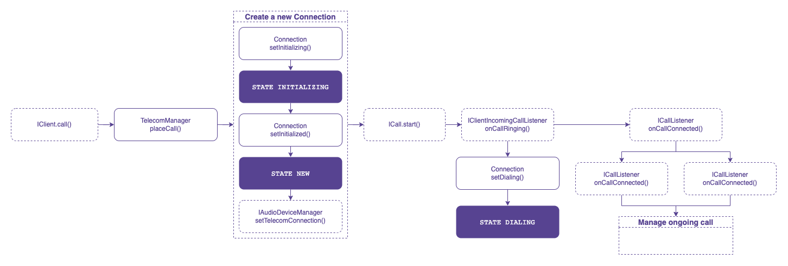
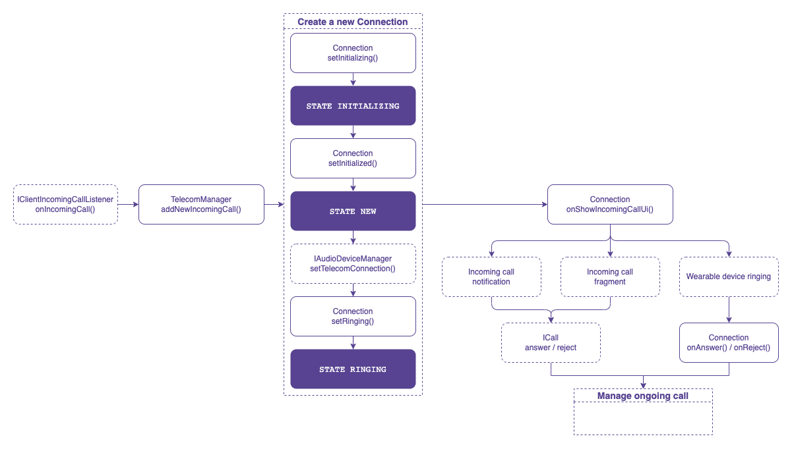
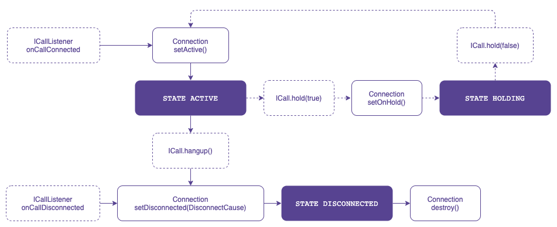
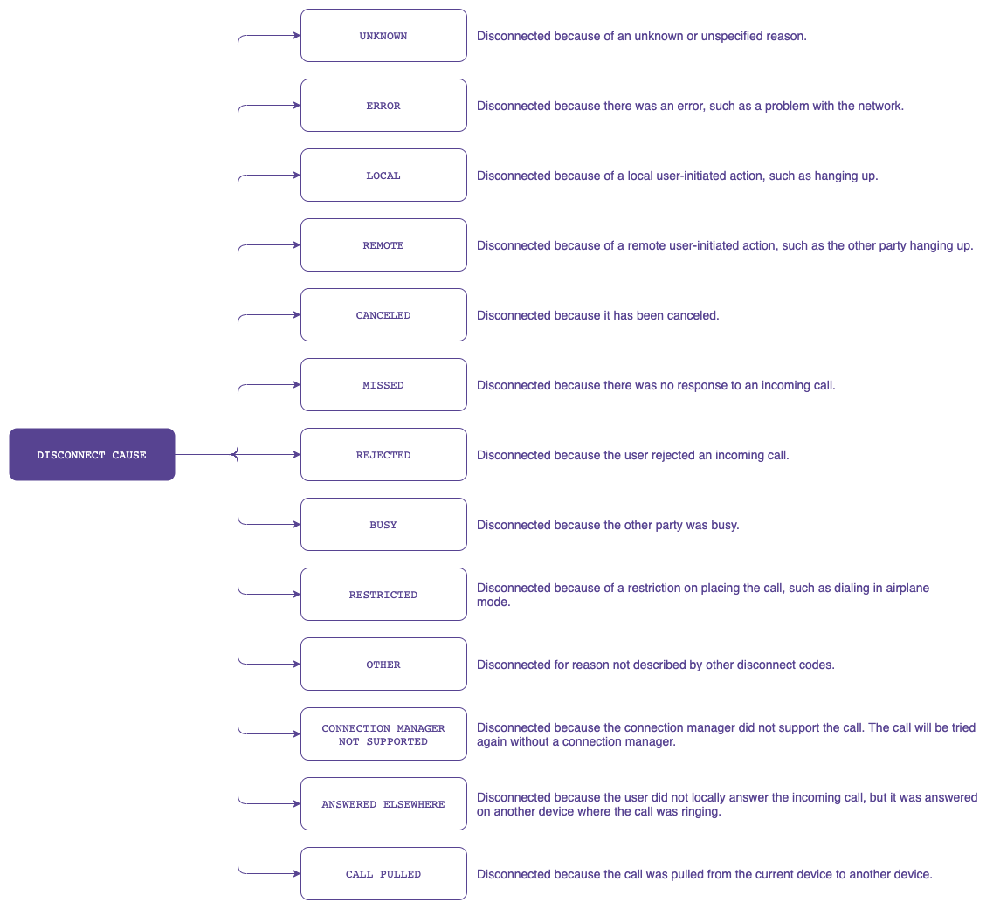

# ConnectionService
This article provides a step-by-step tutorial to integrate a self-managed `ConnectionService` into a VoIP Android application based on the Voximplant Android SDK.

A self-managed `ConnectionService` resolves the situation of multiple calls from various applications that also use the ConnectionService API, such as switching between calls on hold or answering an incoming call when you're already on a call. It also allows answering or declining calls on wearable devices.

## Check system feature availability
A self-managed `ConnectionService` can only be used if the system has the `FEATURE_TELECOM` or `FEATURE_CONNECTION_SERVICE` features.
Otherwise, the system throws an exception on any TelecomManager API call.

System features can be checked via [PackageManager.hasSystemFeature](https://developer.android.com/reference/android/content/pm/PackageManager#hasSystemFeature(java.lang.String)).

## Manifest declarations and permissions
To integrate a self-managed `ConnectionService`, declare the `MANAGE_OWN_CALLS` permission in the AndroidManifest.xml file.
```XML
<uses-permission android:name="android.permission.MANAGE_OWN_CALLS" />
```
To connect `Telecom` to `ConnectionService`, declare the service itself and the BIND_TELECOM_CONNECTION_SERVICE permission in the AndroidManifest.xml file.
```XML
<service
    android:name=".services.CallConnectionService"
    android:permission="android.permission.BIND_TELECOM_CONNECTION_SERVICE">
    <intent-filter>
        <action android:name="android.telecom.ConnectionService" />
    </intent-filter>
</service>
```

## TelecomManager and PhoneAccount
`TelecomManager` uses a registered `PhoneAccount` to place a phone/VoIP call. To build a `PhoneAccount`, the app should provide a valid `PhoneAccountHandle` which refers to the connection service implementation that `Telecom` will use to interact with the app.

A `PhoneAccountHandle` consists of a component name of the associated connection service and a string identifier that is unique among `PhoneAccountHandles` with the same component name. See `PhoneAccountHandler` on the [Android Developers](https://developer.android.com/reference/android/telecom/PhoneAccountHandle) site.

```Kotlin
val componentName = ComponentName(context, CallConnectionService::class.java)
val phoneAccountHandle = PhoneAccountHandle(componentName, APP_TAG)
val phoneAccount = telecomManager.getPhoneAccount(phoneAccountHandle)
telecomManager.registerPhoneAccount(phoneAccount)
```
For a self-managed `ConnectionService`, set `PhoneAccount.CAPABILITY_SELF_MANAGED` to indicate that this `PhoneAccount` is responsible for managing its own `Connection`.

## Create and manage a call connection

### Android Telecom Connection
A `Connection` represents a phone call or connection to a remote endpoint that carries voice and/or video traffic.

This definition requires a new Android Telecom Connection to be created for each outgoing (before `ICall.start()`) and incoming (before `ICall.answer()`) Voximplant call.
This way the Voximplant ICall interface manages a VoIP call and Telecom Connection registers this call in the telecom subsystem.

Every self-managed `Connection` must be specified with the following parameters:
```Kotlin
connectionProperties = PROPERTY_SELF_MANAGED
audioModeIsVoip = true
```

You can also use additional features such as putting a call on hold or muting with `connectionCapabilities`. Find the full list of features on the [Android Developers](https://developer.android.com/reference/android/telecom/Connection) site.

Please note:
Each new `Connection` should be passed to the Voximplant SDK via `IAudioDeviceManager.setTelecomConnection()` to manage audio devices.

### Make an outgoing call
To create an outgoing call, check that a `PhoneAccount` is registered and then use the `TelecomManager.placeCall()` method.

A self-managed `ConnectionService` must contain `EXTRA_PHONE_ACCOUNT_HANDLE` in the Bundle extra to specify the `PhoneAccountHandle` associated with it.

If the app can place an outgoing call, the telecom subsystem calls the `onCreateOutgoingConnection()` method to where the app must return a new `Connection` to represent a new outgoing call.

It is important to call `Connection.setActive()` once the outgoing call is connected. It notifies the telecom subsystem that the call is in progress.



### Receive an incoming call
When the app receives an incoming call via the Voximplant SDK (`IClientIncomingCallListener.onIncomingCall()`), it is necessary to check the `PhoneAccount` registration in the system. To register a new incoming call, use the `TelecomManager.addNewinsomingCall()` method.

The telecom subsystem binds to the app's `ConnectionService` and requests a new `Connection` instance for the incoming call using the `ConnectionService.onCreateIncomingConnection()` API. Upon receiving this event, the application needs to create a `Connection`.

For a self-managed connection service, the `Connection` will trigger the `Connection.onShowIncomingCallUi()` event to let the application know when to display the incoming call UI. Showing a notification with full-screen intent is recommended.

The user may accept and reject the incoming call from the incoming call notification or wearable devices:
- If the user answers or rejects the call from the notification, it should be handled by the application via PendingIntent.
- If the user answers or rejects the call from a wearable device, the `Connection` will inform you about this action by triggering the `Connection.onAnswer()` or `Connection.onReject()` event.

To answer the call, you need the `ICall.answer()` API. Establish the call connection using the Voximplant Android SDK and update the `Connection` state to active once the call is connected (`ICallListener.onCallConnected()`).

To reject the call, you need the `ICall.reject()` API. The Voximplant Android SDK triggers the `ICallListener.onCallDisconnected()` event as soon as the call is ended. The application must set the `Connection` status to disconnected and destroy the `Connection`.



### Manage ongoing call
The Voximplant Android SDK provides the following capabilities for an ongoing call:
- Put the call on hold
- Mute
- Change the audio device

Mute and audio device changing capabilities are fully managed by the Voximplant Android SDK and do not require any `Connection` API call.

However, to put the call on hold, the application `Connection` state should be changed via the `Connection.setOnHold()` API. Please be sure to change the `Connection` state only if `ICall.hold()` is completed successfully.

```Kotlin
call?.hold(hold, object : ICallCompletionHandler {
    override fun onComplete() {
        if (hold) {
            callConnection?.setOnHold()
        } else {
            callConnection?.setActive()
        }
    }

    override fun onFailure(e: CallException) {}
})
```

Please note:
- On devices running Android API level 28 or higher, when an incoming PSTN call is answered by the user, the VoIP ongoing call is put on hold by `TelecomManager` and can be resumed after the PSTN call ends.
- On devices running Android API level 27 or lower, only one app can maintain an ongoing call at any given time. This constraint means that the ongoing call will be terminated.



### End ongoing call
Either a user or a remote party can end an ongoing call.

If the user ends the call, the application should call `ICall.hangup()` API, so the Voximplant Android SDK triggers the `ICallListener.onCallDisconnected()` event.

If the remote party ends the call, the Voximplant Android SDK informs the application by triggering the `ICallListener.onCallDisconnected()` event.

After receiving the `ICallListener.onCallDisconnected()` event you need to:
1. Change the `Connection` status to disconnected via `Connection.setDisconnected(DisconnectCause)`
2. Destroy the `Connection` via `Connection.destroy()` API to destroy the Connection object.

`DisconnectCause` describes the cause of a disconnected call. It always includes a code describing the generic cause of the disconnect. Optionally, it may include a label and/or description to be displayed to the user. The `ConnectionService` provides localized versions of the label and description. It may also contain a disconnect reason used for the logs, and not intended for the user.

See `DisconnectCause` on the [Android Developers](https://developer.android.com/reference/android/telecom/DisconnectCause) site for more information.


