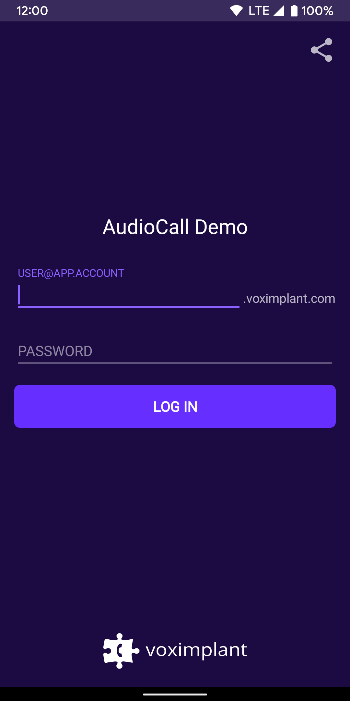
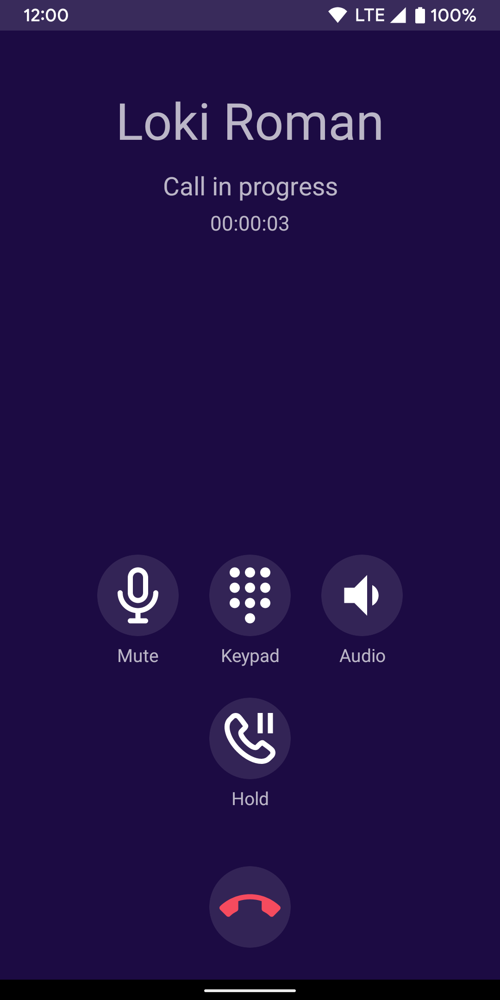
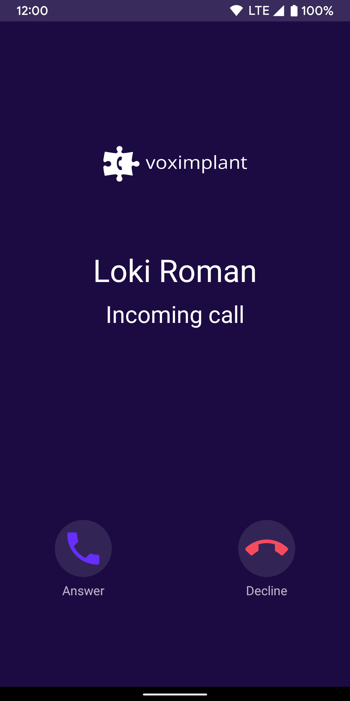
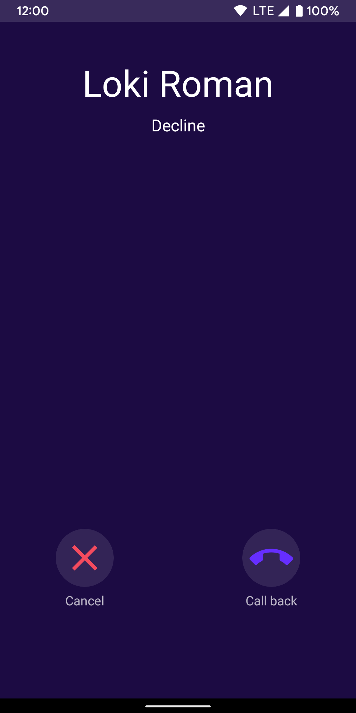

# Voximplant Audio Call Demo with ConnectionService integration

This demo demonstrates audio call of the Voximplant Android SDK with ConnectionService integration. The application supports audio calls between this Android app and other apps that use any Voximplant SDK. 

Based on MVVM architectural pattern.

`ConnectionService` is an abstract service that could be implemented by any apps which either: 
1. Can make phone calls (VoIP or otherwise) and want those calls to be integrated into the built-in phone app. Referred to as a system managed `ConnectionService`.
2. Are a standalone calling app and don't want their calls to be integrated into the built-in phone app. Referred to as a self managed `ConnectionService`.
`ConnectionService` requires Android API level 23 according to the [official Android documentation](https://developer.android.com/reference/android/telecom/ConnectionService), but this app uses `Connection.PROPERTY_SELF_MANAGED` which requires API level 26.

## Features
The application is able to:
- log in to the Voximplant Cloud
- make an audio call
- receive an incoming call
- put a call on hold / take it off hold
- change an audio device (speaker, receiver, wired headset, bluetooth headset) during a call
- mute audio during a call
- receive push notifications (requires additional setup)
- proximity sensor usage

## Install the app

### From the source code

1. Clone this repository
2. Select AudioCall and build the project using Android Studio

### Download the application build

Use the [invite link](https://appdistribution.firebase.dev/i/a22e2c002c4ae0fd) to get access the latest builds and subscribe for the application updates.

| :warning: &nbsp;&nbsp; Please consider that you need to set up a Voximplant account to make calls. Please follow the instructions below. |
| :--- |

| :warning: &nbsp;&nbsp; Push notifications require additional setup. If the application is built from the source code, [set up push notifications](https://voximplant.com/docs/howtos/sdks/push_notifications/android_sdk). If the application was installed from the invite link, push notifications cannot be configured. |
| :--- |

## Getting started
To get started, you'll need to [register](https://voximplant.com) a free Voximplant developer account.

You'll need the following:
- Voximplant application
- two Voximplant users
- VoxEngine scenario
- routing setup

### Automatic
We've implemented a special template to enable you to quickly use the demo – just
install [SDK tutorial](https://manage.voximplant.com/marketplace/sdk_tutorial) from our marketplace:


### Manual
You can set up it manually using our [quickstart guide](https://voximplant.com/docs/introduction/integration) and tutorials

#### VoxEngine scenario example:
```js
require(Modules.PushService);
VoxEngine.addEventListener(AppEvents.CallAlerting, (e) => {
const newCall = VoxEngine.callUserDirect(
  e.call,
  e.destination,
  e.callerid,
  e.displayName,
  null
);
VoxEngine.easyProcess(e.call, newCall, ()=>{}, true);
});
```

## Usage

### User login


Log in using:
* Voximplant user name in the format `user@app.account`
* password

### Call
<table>
  <tr>
    <td>Main</td>
    <td>Ongoing call</td>
    <td>Incoming call</td>
    <td>Failed call</td>
  </tr>
  <tr>
    <td></td>
    <td></td>
    <td></td>
    <td></td>
  </tr>
</table>

### Connection service
Find more information about Voximplant Android SDK integration with the ConnectionService [here](ConnectionService.MD).

## Useful links
1. [Quickstart](https://voximplant.com/docs/introduction)
2. [Voximplant Android SDK reference](https://voximplant.com/docs/references/androidsdk)
3. [Using Voximplant Android SDK](https://voximplant.com/docs/references/androidsdk/using-android-sdk)
4. [HowTo's](https://voximplant.com/docs/howtos)

## Have a question
- contact us via `support@voximplant.com`
- create an issue
- join our developer [community](https://discord.gg/sfCbT5u)