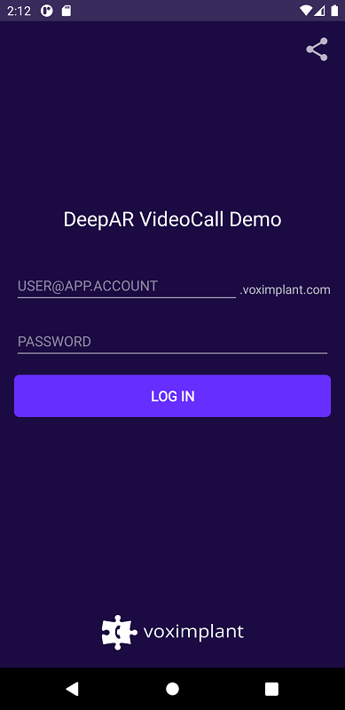
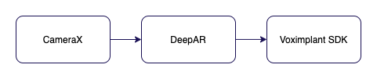
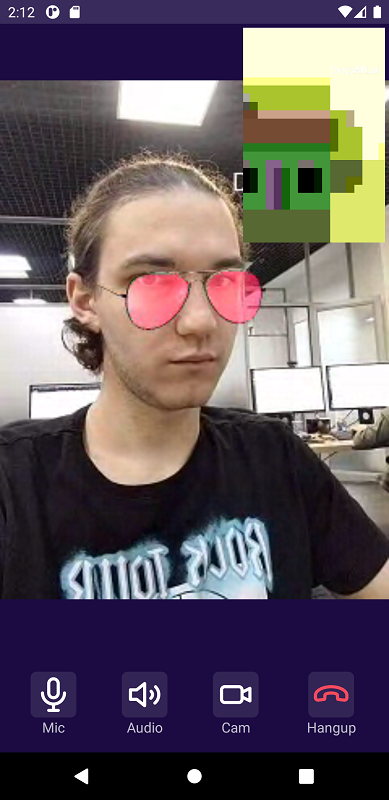

# Voximplant DeepAR Video Call Demo (Android)

This demo demonstrates the integration of Voximplant Android SDK and DeepAR SDK to add face masks to a video call app.
The application supports video calls between this Android app and other apps that use any Voximplant SDK.
Based on MVVM architectural pattern.

Please follow [Installing](#installing) section to correct setup application.

## Features
The application is able to:
- log in to the Voximplant Cloud
- make/receive video call
- add 3D face mask to the local video using DeepAR SDK

## Getting started
To get started, you'll need to [register](https://voximplant.com) a free Voximplant developer account.

You'll need the following:
- Voximplant application
- two Voximplant users
- VoxEngine scenario
- routing setup

### Automatic
We've implemented a special template to enable you to quickly use the demo – just 
install [SDK tutorial](https://manage.voximplant.com/marketplace/sdk_tutorial) from our marketplace:


### Manual
You can set up it manually using our [quickstart guide](https://voximplant.com/docs/references/articles/quickstart) and tutorials

#### VoxEngine scenario example:
```javascript
require(Modules.PushService);
VoxEngine.addEventListener(AppEvents.CallAlerting, (e) => {
    const newCall = VoxEngine.callUserDirect(
        e.call, 
        e.destination,
        e.callerid,
        e.displayName,
        null
    );
    VoxEngine.easyProcess(e.call, newCall, ()=>{}, true);
});
```

## Installing
1. Clone this repo;
2. Go to [DeepAR](https://developer.deepar.ai/), sign up, create the project and the Android app, copy license key and paste it to `apikey.properties` (instead of *YOUR_DEEP_AR_TOKEN_HERE* string);
3. Download the [DeepAR SDK](https://developer.deepar.ai/) and copy the **deepar.aar** into `android-sdk-kotlin-demo/deepar/` folder;
4. Select **videocall-deepar** and build the project using Android Studio.

This demo app adds aviators face mask to the local video. You can download additional assets from [DeepAR downloads](https://developer.deepar.ai/downloads), place them into `android-sdk-kotlin-demo/videocall-deepar/src/main/assets/` folder and apply them in the [DeepARHelper](src/main/java/com/voximplant/demos/kotlin/videocall_deepar/services/DeepARHelper.kt) class.

## Usage

### User login


Log in using:
* Voximplant user name in the format `user@app.account`
* password

See the following files for code details:
- [AuthService](src/main/java/com/voximplant/demos/kotlin/videocall_deepar/services/AuthService.kt)
- [LoginPackage](src/main/java/com/voximplant/demos/kotlin/videocall_deepar/stories/login)

### Make or receive calls


Enter a Voximplant user name to the input field and press "Call" button to make a call.

See the following files for code details:
- [VoximplantCallManager](src/main/java/com/voximplant/demos/kotlin/videocall_deepar/services/VoximplantCallManager.kt)
- [MainPackage](src/main/java/com/voximplant/demos/kotlin/videocall_deepar/stories/main)
- [incomingCallPackage](src/main/java/com/voximplant/demos/kotlin/videocall_deepar/stories/incoming_call)

### Call screen and DeepAR


Local video is captured using [CameraX API](https://developer.android.com/training/camerax).

The application process each frame using `ImageAnalysis.Analyzer API`, then transforms to `YUV_420_888` format and passes it to DeepAR SDK.

DeepAR applies a mask/effect and renders the frame (using on-screen rendering mode) to a SurfaceTexture. This SurfaceTexture is created using Voximplant [SurfaceTextureHelper](https://voximplant.com/docs/references/androidsdk/hardware/icustomvideosource#setsurfacetexturehelper) API that holds common OpenGL ES resources and allows the SDK to take the final frames to encode and send. SurfaceTextureHelper must be created with shared `ClientConfig.eglBase` context.

SurfaceTexture, as the source of video frames, is connected to the call using `ICustomVideoSource.setSurfaceTextureHelper` API.

See the following files for code details:
- [DeepARHelper](src/main/java/com/voximplant/demos/kotlin/videocall_deepar/services/DeepARHelper.kt)
- [CameraHelper](src/main/java/com/voximplant/demos/kotlin/videocall_deepar/services/CameraHelper.kt)



## Useful links
1. [Quickstart](https://voximplant.com/docs/introduction)
2. [Voximplant Android SDK reference](https://voximplant.com/docs/references/androidsdk)
3. [DeepAR SDK](https://www.deepar.ai/)
4. [HowTo's](https://voximplant.com/blog/howto) 
5. [Push Notifications Tutorial](https://voximplant.com/docs/references/androidsdk/push-notifications-for-android)